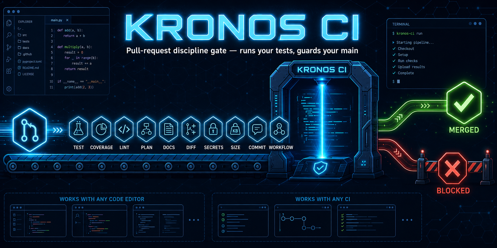

# KRONOS CI

> A pull-request discipline gate for AI-assisted (and human) development.
> It **verifies artifacts, not declarations** — instead of trusting that "the tests passed",
> it runs your tests itself and fails the check if they don't.

**Version 0.7.1** · GPL-3.0 · sibling of **[KRONOS](https://github.com/dzylab/kronos)** (the
Claude Code commit-time engine). KRONOS guards an AI coding session locally; **KRONOS CI guards the
shared branch in CI** — for *any* contributor and *any* tool (Cursor, Copilot, a local LLM, or a
human), because it lives below the AI layer, at the pull request.

> 🌊 **New to all this, or a vibe coder?** Start with **[VIBE-CODING.md](VIBE-CODING.md)** — a
> plain-words guide that gets you running in ~3 minutes.

---

## What it checks

On each pull request (or push), KRONOS CI runs up to ten independent checks. Each is off by
default (except the merge-conflict and secrets scans) and turned on via the Action inputs:

| Check | What it does | Fails the gate when… |
|---|---|---|
| **TEST** | Runs your `test-command` itself (optionally scans its output) | it exits non-zero — or, with `scan-test-output`, prints a failure marker on exit 0 |
| **COVERAGE** | Runs `coverage-command` and parses the percentage | coverage is below `coverage-min`, or no percentage found |
| **LINT** | Runs your `lint-command` | it fails **and** `lint-required: true` (else advisory) |
| **PLAN** | Looks for a plan file (`plan-glob`) | no file ≥ `plan-min-lines` lines exists |
| **DOCS** | Compares the diff: code-vs-docs | code changed but no docs changed |
| **DIFFSCAN** | Scans added diff lines | a merge-conflict marker (always) or a `forbidden-patterns` match is present |
| **SECRETS** | Scans added diff lines for credential shapes (AWS keys, GitHub tokens, private keys, hardcoded passwords). **ON by default**; never prints the secret itself | a credential shape is added |
| **SIZE** | Counts the added lines | more than `size-max-lines` (advisory unless `size-required`) |
| **COMMIT-MSG** | Checks commit subjects | a subject doesn't match `commit-pattern` |
| **WORKFLOW** | Verifies a committed `WORKFLOW.md` (the full 5-stage process) | a stage is `[x]` without its artifact, or left open |

The gate exits non-zero if any **required** check fails, so branch protection can require it and
block the merge. A genuine hotfix can [bypass it](#bypass-for-genuine-hotfixes) — loudly and on the record.

---

## 60-second setup

The fastest way — let it bootstrap itself (detects pytest / npm / go / cargo):

```bash
python /path/to/kronos-ci/kronos_ci.py init
```

Or by hand:

1. Copy [`examples/kronos.yml`](examples/kronos.yml) into your repo at `.github/workflows/kronos.yml`.
2. Set your `test-command` (e.g. `pytest -q`, `npm test`, `go test ./...`).
3. Commit. Open a PR — KRONOS CI runs and reports.

```yaml
- uses: actions/checkout@v4
  with:
    fetch-depth: 0          # needed only for the diff-based checks
- uses: dzylab/kronos-ci@v0.7.1
  with:
    test-command: "pytest -q"
```

To make it a merge blocker: repo **Settings → Branches → Branch protection → Require status checks**,
and select **KRONOS CI**.

### Examples by stack

Drop-in starting points for `.github/workflows/kronos.yml`. KRONOS CI runs *your* command, so these
are **starting points, not a stack lock-in** — and `init` can generate one for you:

| Stack | File | Runs |
|---|---|---|
| Generic / Python | [`examples/kronos.yml`](examples/kronos.yml) | `pytest -q` |
| Python (full) | [`examples/python.yml`](examples/python.yml) | pytest + coverage + ruff |
| Web — Vite (minimal) | [`examples/web-vite.yml`](examples/web-vite.yml) | `vitest` + eslint |
| Web — Next.js + TS | [`examples/web-nextjs.yml`](examples/web-nextjs.yml) | `tsc --noEmit` + `vitest` + lint |
| Go | [`examples/go.yml`](examples/go.yml) | `go test ./...` + golangci-lint |
| Rust | [`examples/rust.yml`](examples/rust.yml) | `cargo test` + clippy |

> Styling (Tailwind, CSS) has no "test" to run — the web examples verify JS/TS **logic, types, and lint**.

---

## Configuration (Action inputs)

| Input | Default | Meaning |
|---|---|---|
| `test-command` | `""` | Shell command to run the tests. Empty = TEST skipped. |
| `lint-command` | `""` | Shell command to lint. Empty = LINT skipped. |
| `lint-required` | `"false"` | `true` makes lint failures fail the gate. |
| `require-plan` | `"false"` | `true` requires a plan file. |
| `plan-glob` | `"plans/*.md"` | Where plans live. |
| `plan-min-lines` | `"20"` | Minimum plan length. |
| `require-docs` | `"false"` | `true` requires docs changes when code changes. |
| `code-paths` | `src/**,lib/**,app/**,*.py,*.js,*.ts,*.go,*.rs,*.java,*.rb` | Globs counted as code. |
| `docs-paths` | `docs/**,*.md,README*` | Globs counted as docs. |
| `base-ref` | `""` | Diff base. Default: the PR base, else `HEAD~1`. |
| `scan-test-output` | `"false"` | Also fail TEST on failure markers even when it exits 0. |
| `test-fail-markers` | `Traceback…,FAILED,=== FAILURES ===` | Substrings that mean "tests failed". |
| `forbidden-patterns` | `""` | Comma-separated regexes forbidden in added diff lines (DIFFSCAN). |
| `commit-pattern` | `""` | Regex every commit subject must match (e.g. conventional commits). |
| `allow-bypass` | `"true"` | Honor a bypass token in the latest commit message. |
| `bypass-token` | `[kronos skip]` | The token that bypasses the gate (recorded loudly). |
| `workflow-file` | `""` | Path to a committed `WORKFLOW.md` to verify the full process. Empty = off. |
| `profile` | `""` | Rigor preset: `minimal` / `standard` / `strict`. |
| `type` | `""` | Task type: `trivial`…`ops` — relaxes or tightens the required checks. |
| `coverage-command` | `""` | Command that prints a coverage percentage. Empty = off. |
| `coverage-min` | `"0"` | Minimum coverage percent — fail below it. |
| `secrets-scan` | `"true"` | Scan added diff lines for credential shapes (set `false` to disable). |
| `size-max-lines` | `""` | Warn/fail when the PR adds more lines than this. Empty = off. |
| `size-required` | `"false"` | `true` makes SIZE a hard gate (else advisory). |
| `comment-pr` | `"false"` | Post the report as a PR comment (needs `github-token`). |
| `github-token` | `""` | Token for the PR comment — pass `${{ secrets.GITHUB_TOKEN }}`. |
| `command-timeout` | `"1800"` | Seconds before a test/lint/coverage command is killed. |

**Outputs:** `result` (`pass` / `fail` / `bypassed`) and `failed-checks` (comma-separated).

Booleans accept `true/1/yes/on`. Globs: `**` means "anything under here" (e.g. `src/**`); a
slash-free pattern like `*.py` also matches the file name anywhere. The toggles `require-plan`,
`require-docs`, `lint-required`, `scan-test-output` **inherit** from `type` then `profile` when left
empty; an explicit value always wins.

---

## Bypass (for genuine hotfixes)

Sometimes you must merge *now*. Put the bypass token in your latest commit message and the gate
passes — but **loudly**: a warning annotation, a line in the step summary, and `result=bypassed`
on the output. Nothing is hidden.

```
[kronos skip] emergency: revert bad deploy
```

The token is `[kronos skip]` by default (`bypass-token`); the whole mechanism can be turned off with
`allow-bypass: "false"`.

---

## Full-discipline mode (profiles, types, WORKFLOW)

KRONOS CI can enforce the **whole development process**, not just tests — making it a superset of the
[KRONOS](https://github.com/dzylab/kronos) gates, re-checked on the pull request.

- **Profiles** — one knob for rigor: `profile: minimal | standard | strict`. `strict` turns on
  `scan-test-output`, `lint-required`, `require-plan`, and `require-docs` at once.
- **Task types** — `type: trivial | micro | medium | large | ops` (or read from your `WORKFLOW.md`)
  scales the bar: `trivial`/`micro` relax PLAN/DOCS; `large`/`ops` require them.
- **WORKFLOW verification** — point `workflow-file: WORKFLOW.md` at a committed process record and
  KRONOS CI checks that every stage marked `[x]` is backed by its real artifact (a plan exists, the
  Test log is filled, docs were updated). A stage ticked without its artifact — or left open — fails
  the gate. This is the KRONOS guarantee, enforced in CI.

```yaml
- uses: dzylab/kronos-ci@v0.7.1
  with:
    test-command: "pytest -q"
    profile: "strict"
    workflow-file: "WORKFLOW.md"
```

---

## The DOCS check & shallow clones

The DOCS check needs the git history to compute the diff. `actions/checkout` defaults to a shallow
clone, so set `fetch-depth: 0` (as the example does). If KRONOS CI still can't determine the changed
files, the DOCS check **SKIPS** with a hint — it never produces a false failure.

---

## Use it anywhere — any editor, any CI

KRONOS CI is **not tied to Claude Code** (that's [KRONOS](https://github.com/dzylab/kronos)). It lives
at the **git layer**, below the AI layer, so it works no matter who or what wrote the code — Cursor,
Windsurf, VS Code + Copilot, Aider, a local LLM, or a human by hand.

**1. One-off, from any shell or AI tool:**
```bash
INPUT_TEST_COMMAND="pytest -q" python kronos_ci.py verify
python kronos_ci.py --self-test    # internal tests
python kronos_ci.py --version
```

**2. As a local git hook (Cursor / Windsurf / VS Code / terminal).** Install once and it runs on every
push — in *any* editor, because it fires on `git`, not on the IDE:
```bash
git clone https://github.com/dzylab/kronos-ci
cd your-project
/path/to/kronos-ci/install.sh                                  # pre-push hook (or: install.sh pre-commit)
cp /path/to/kronos-ci/.kronos-ci.env.example .kronos-ci.env    # then set your test-command
```

**3. On GitHub** — use the Action (the [60-second setup](#60-second-setup) above).

**4. On any other CI** (GitLab, Bitbucket, Jenkins, …) — just call the CLI with `INPUT_*` env vars; a
non-zero exit fails the job. **Zero dependencies** (Python 3.8+ stdlib and git only).

> It is a git-level gate, **not an in-editor real-time plugin** — it checks at commit / push / PR time,
> not as you type.

---

## Integrations: PR comment & machine-readable JSON

**PR comment (opt-in).** Post the report right onto the pull request:

```yaml
- uses: dzylab/kronos-ci@v0.7.1
  with:
    test-command: "pytest -q"
    comment-pr: "true"
    github-token: ${{ secrets.GITHUB_TOKEN }}
```

It is strictly **fail-safe** — if the comment cannot be posted (no token, network), you get a warning,
never a failed gate.

**JSON contract.** `kronos_ci.py verify --json` makes the **last stdout line** a single JSON object —
`{version, result, failed, checks:[{name,status,note}]}` — so any tool, script, or AI agent can consume
the verdict programmatically. This is the stable machine interface for building on top of KRONOS CI.

---

## What a green check should mean

Without a gate, a passing pull request is a *claim*. KRONOS CI makes it *evidence*. We won't put a
number on it — that would be the exact over-optimism this tool exists to stop — but here is the shape:

| | Typical PR flow without KRONOS CI | With KRONOS CI |
|---|---|---|
| **Tests** | the PR says "✅ tests pass" — nobody re-ran them | CI runs them itself; red blocks the merge |
| **Secrets** | an API key slips into the diff | the diff is scanned; the merge is blocked |
| **Docs** | code changes, docs quietly go stale | code-without-docs is flagged |
| **Main** | a green checkmark hides a broken `main` | the gate fails first; `main` stays green |

---

## Philosophy

LLM agents — and people — are optimistic. They write "tests pass" and move on. KRONOS CI removes
the trust: it runs the tests in CI and reports the truth. It is the CI-native expression of one
idea: **completion is evidence, not a declaration.**

It is deliberately small and config-driven — turn on only the checks you want, with graceful
degradation. See **[THREAT_MODEL.md](THREAT_MODEL.md)** for exactly what it does and does not protect
against, and **[PRINCIPLES.md](PRINCIPLES.md)** for the design principles a clean change should follow —
guidance for the author, with the mechanical slice (complexity, length, nesting) enforced via your linter.

## KRONOS vs KRONOS CI — which one?

Both share one idea — *verify artifacts, not declarations* — at two different layers. They are
**complementary, not competitors.**

| | **KRONOS** | **KRONOS CI** |
|---|---|---|
| Form | a local `git commit` hook + slash-commands | a GitHub Action + CLI + a local git hook |
| When | in-flow, as the AI codes — blocks the **commit** | post-hoc — blocks the **merge** (or the push, via the local hook) |
| Where | your machine (Claude Code only) | GitHub runners, any CI, or any editor via the local hook |
| Who | you, coding with Claude Code | any contributor, any tool, or a human |
| Tests | trusts a green test log | **runs the tests itself** (plus coverage) |
| Scope | rich process discipline: 5 stages, task types, doc routing, watchdog, standards | ten focused checks + full-discipline mode (profiles, types, WORKFLOW verification) + design-principles guidance |
| Source of truth | a local `WORKFLOW.md` | the pull request diff (and a committed `WORKFLOW.md`, if enabled) |

- **Use KRONOS** to keep an AI coding session disciplined on your machine, while you code.
- **Use KRONOS CI** to guard the shared branch for *everyone* — even contributors who never open
  Claude Code.
- **Best together:** KRONOS locally + KRONOS CI on the repo. One philosophy, two layers.

KRONOS (the Claude Code engine): [github.com/dzylab/kronos](https://github.com/dzylab/kronos).

---

## What it is NOT

- **Not a security boundary.** It is a *discipline gate* against honest-but-optimistic mistakes,
  not a defense against a hostile actor (who controls the workflow file).
- **Not a test framework, linter, or quality scorer.** It orchestrates the tools you already use.
- **Not a replacement for code review.**

## License

GPL-3.0 — see [LICENSE](LICENSE). Author: **dzylab** ·
sibling project: [github.com/dzylab/kronos](https://github.com/dzylab/kronos).
